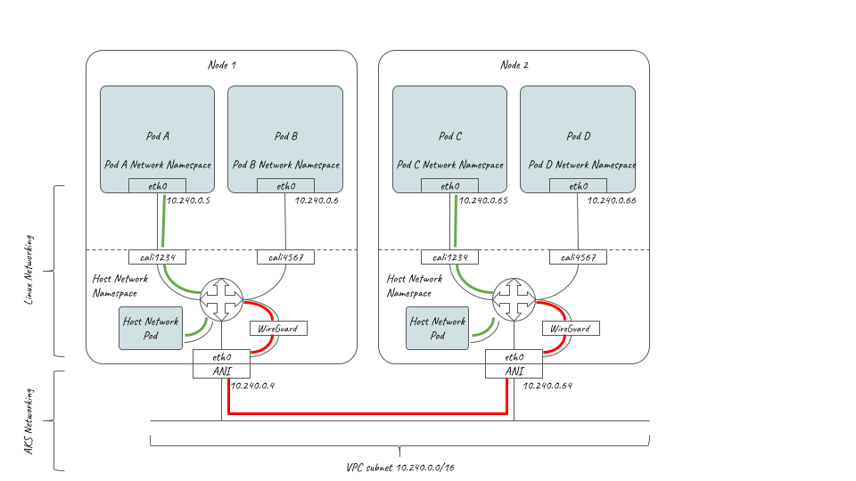

```
  
---
original: https://thenewstack.io/calico-wireguard-support-with-azure-cni/
author: Peter Kelly
translator: https://github.com/t819088691/
reviewer: 
title: Calico WireGuard Support with Azure CNI
summary: 讲述 WireGuard 可以在 k8s 中使用的解决方案
categories: kubernetes
tags: calico
originalPublishDate: 2021-08-12
publishDate: 
---

```


# 在 Azure CNI 中启用 Calico WireGuard


去年6月，[Tigera](https://www.tigera.io/?utm_content=inline-mention) 宣布首次在 k8s 上支持用于集群内加密传输的开源 vpn，[WireGuard](https://www.wireguard.com/) 。我们从来不喜欢坐以待毙，所以我们一直在努力为这项技术开发一些令人兴奋的新功能，其中第一个功能是使用 [Azure 容器网络接口](https://github.com/Azure/azure-container-networking/blob/master/docs/cni.md)（CNI）在 [Azure Kubernetes 服务](https://azure.microsoft.com/en-us/services/kubernetes-service/)（AKS）上支持WireGuard。


首先，这里简单回顾一下什么是 WireGuard 以及我们如何在 Calico 中使用它。

WireGuard 是一种 VPN 技术，从 linux 5.6 内核开始默认包含在内核中，它被定位为 IPsec 和 OpenVPN 的替代品。它的目标是更加快速、安全、易于部署和管理。正如不断涌现的 SSL/TLS 的漏洞显示，密码的敏捷性会极大增加复杂性，这与 WireGuard 的目标不符，为此，WireGuard 故意将密码和算法的配置灵活性降低，以减少该技术的可攻击面和可审计性。它的目标是更加简单快速，所以使用标准的 Linux 网络命令便可以很容易的对它进行配置，并且只有约 4000 行代码，使得它的代码可读性高，容易理解、审查。


WireGuard 是一种 VPN 技术，通常被认为是 C/S 架构。它同样能在对等的网格网络架构中配置使用，这就是 Tigera 设计的 WireGuard可以在 Kubernetes 中启用的解决方案。使用 Calico，将所有启用 WireGuard 的节点相互对等形成一个加密的网格。它甚至支持在同一集群内同时包含启用 WireGuard 的节点与未启用 WireGuard 的节点，并且可以相互通信。


我们选择 WireGuard 并不是一个折中的方案。我们希望提供最简单、最安全、最快速的方式来加密传输 Kubernetes 集群中的数据，mTLS、IPsec 或复杂的配置不是我们想要的。事实上，您可以把 WireGuard 看成是另一个具有加密功能的 overlay。


用户只需一条命令就可以启用 WireGuard，而 Calico 负责完成剩余的工作，包括：

- 在每个节点创建 WireGuard 的网络接口
- 计算编写最优的 MTU
- 为每个节点创建 WireGuard 公钥私钥对
- 向每个节点添加公钥，以便在集群中共享资源
- 将所有节点编辑为对等节点
- 使用防火墙标记（fwmark）编辑 IP  route、IP tables和 Routing tables，以此正确处理各自节点上的路由


您仅需指明意图，其他的事情都由集群完成


## 使用 WireGuard 时数据包流量的情况

下图显示了启用 WireGuard 后集群中的各种数据包流量情况。





同一主机上的 Pod：

- 数据包被路由到 WireGuard 表。
- 如果目标 IP 是同一主机上的 pod，则 Calico 将在 WireGuard 路由表中插入一个 “ throw ” 条目，将数据包引导回主路由表。数据包被定向到目标 Pod 的 veth 接口，并且它将在未加密的情况下流动（在图中以绿色显示）。


不同节点上的 Pod：

- 数据包被路由到 WireGuard 表。

- 路由条目与目标 pod IP 匹配并发送到 WireGuard组件： cali.wireguard。

- WireGuard 组件加密并封装数据包（在图中以红色显示）并设置 fwmark 以防止路由环路。

- WireGuard 组件使用它与目标 pod IP（允许的 IP）匹配的对等方的公钥对数据包进行加密，将其封装在 UDP 中，并使用特殊的 fwmark 对其进行标记以防止路由环路。

- 数据包通过 eth0 发送到目标节点并解密。

- 这也适用于主机流量（例如，节点联网的 pod）。


在以下动画中，您可以看到 3 种流量：

1. 同一主机上 Pod 到 Pod 未被加密的流量。
2. 不同主机上的 Pod 到 Pod 被加密的流量。
3. 主机到主机的流量也会被加密。


Key：绿色表示未加密流量，红色表示加密流量。

​      [动画演示](https://tigera.wistia.com/medias/ddl8bmhpgp?utm_source=thenewstack&utm_medium=website&utm_campaign=platform)


## WireGuard 在 AKS 的应用

在 AKS 上使用 Azure CNI 对  WireGuard 的支持带来了一些非常有趣的挑战。

首先，使用 Azure CNI 意味着不使用 Calico IPAM（ IP 地址管理）管理 CIDR（无类域间路由）块分配的 Pod IP 。相反，它们是采用节点IP相同的分配方式从底层 VNet 分配的。这对 WireGuard 路由来说是一个有趣的挑战，以往我们可以在 WireGuard 配置中的 Allowed IPs 列表中添加一个 CIDR 块，相比之下，我们现在必须写出该节点所有 pod IP。这需要 Calico 将 routeSource 的配置设为 workloadIPs。如果您使用的是 AKS 集群进行部署，便无需额外配置。

使用 wireguard-tools 中优秀的工具 [wg](https://git.zx2c4.com/wireguard-tools/about/src/man/wg.8)，可以查看集群内节点允许通过的 IP 列表，其中包括每个节点的 pod IP 和主机 IP（注意终端 IP也在允许 IP 列表中）。在 AKS 上提供了业务流量加密和主机到主机的加密。


```shell
  interface: wireguard.cali
   public key: bbcKpAY+Q9VpmIRLT+yPaaOALxqnonxBuk5LRlvKClA=
   private key: (hidden)
   listening port: 51820
   fwmark: 0x100000

  peer: /r0PzTX6F0ZrW9ExPQE8zou2rh1vb20IU6SrXMiKImw=
   endpoint: 10.240.0.64:51820
   allowed ips: 10.240.0.64/32, 10.240.0.65/32, 10.240.0.66/32
   latest handshake: 11 seconds ago
   transfer: 1.17 MiB received, 3.04 MiB sent

  peer: QfUXYghyJWDcy+xLW0o+xJVsQhurVNdqtbstTsdOp20=
   endpoint: 10.240.0.4:51820
   allowed ips: 10.240.0.4/32, 10.240.0.5/32, 10.240.0.6/32
   latest handshake: 46 seconds ago
   transfer: 83.48 KiB received, 365.77 KiB sent
```


第二个挑战是正确处理 MTU（最大传输单元）。[Azure 设置的 MTU 是 1500](https://docs.microsoft.com/en-us/azure/virtual-network/virtual-network-tcpip-performance-tuning#azure-and-vm-mtu)，而 WireGuard 在数据包上设置了一个 DF（Don't Fragment）标记。如果没有正确调整 WireGuard MTU，我们会在启用 WireGuard 时发现有丢包和低带宽。我们可以在 AKS 中通过Calico 自动检测并为 [WireGuard 的 MTU](https://docs.projectcalico.org/networking/mtu) 设置正确的开销来优化。


我们还可以将节点 IP 本身添加为对等节点允许通信的 IP ，并通过 AKS 中的 WireGuard 处理主机联网的 pod 和主机到主机通信。主机到主机通信的方法是，当 [RPF](https://en.wikipedia.org/wiki/Reverse-path_forwarding)（反向路径转发）发生时，通过 WireGuard 接口获得路由返回的响应。通过在发送到目的节点的数据包上设置一个标记，然后配置内核以尊守 sysctl 中的 RPF 标记来解决这个问题。

现在，在 AKS 上可以完全支持节点之间的业务流量和主机通信加密。您仅需指明意图，其他的事情都由集群完成**。**


