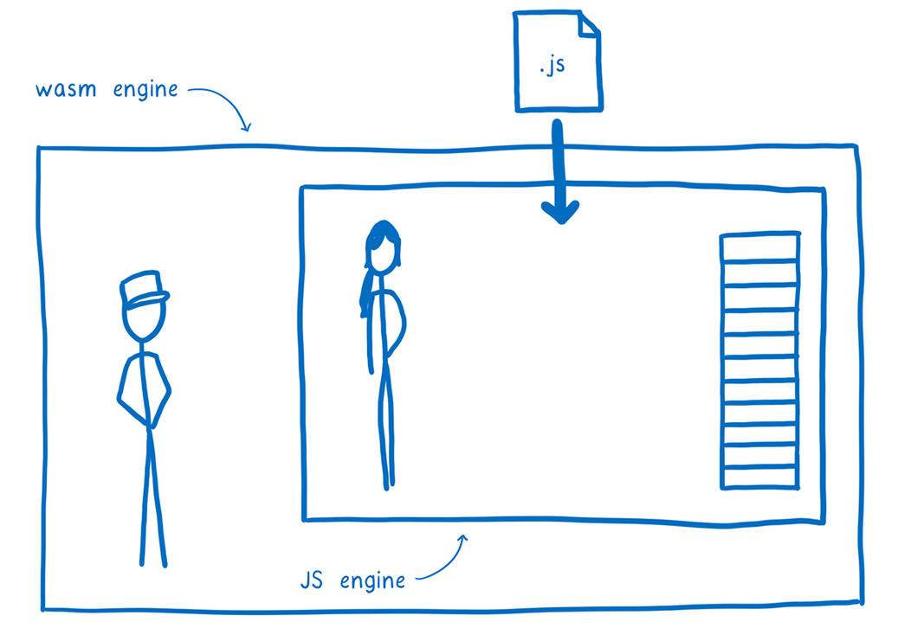
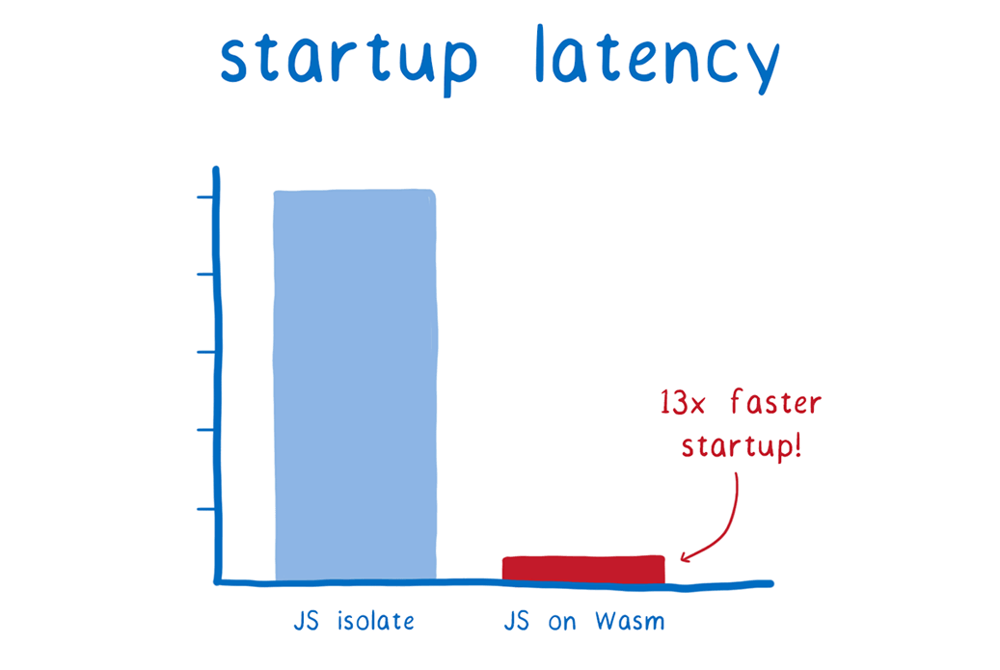
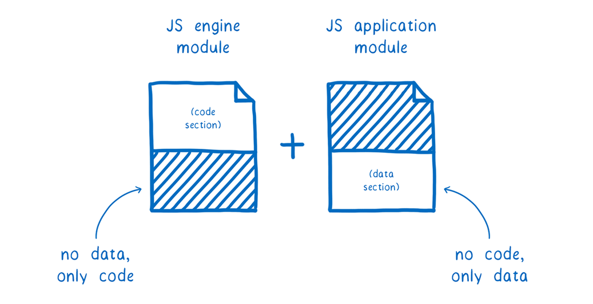
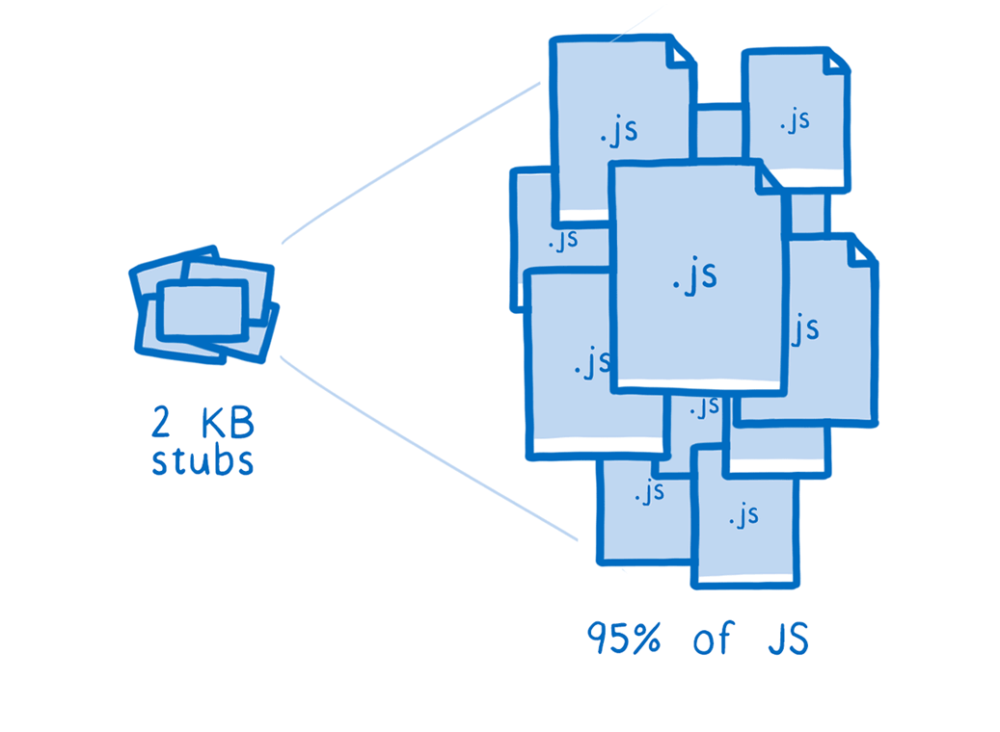

# 让 JavaScript 在 WebAssembly 上快速运行

2021 年 6 月 2 日 林 · 克拉克

浏览器中 JavaScript 的运行速度相较于20年前快了很多倍。那是因为浏览器服务厂商花费了很多时间去做了相关方面密集的性能优化。

今天，我们开始为完全不同的环境优化 JavaScript 的性能，在这些环境中应用不同的规则。并且这是可能的，因为有了WebAssembly ！

这里我们应该明白 —— 如果你在浏览器中运行 JavaScript ，简单的部署 JS 仍然是最有意义的。浏览器中的 JS 引擎经过了高度调优，以运行交付给它们的 JS 。

但是，如果你在 Serverless function 中运行 JS 呢？又或者，如果你想将 JS 运行到像 iOS 或游戏机一样的不允许一般 JIT（ just-in-time ） 编译环境中？

对于这些用例，你需要去关注 JS 优化的新浪潮。并且，这项工作也可以服务于其他编程语言模型，例如Python ， Ruby 和 Lua，它们也想在这些环境中快速运行。

但是，在我们探索这种方法如何快速运行之前，我们需要先了解 WebAssembly 的基本工作原理。

##  WebAssembly 如何工作？

每当您运行 JS 时， JS 源代码都需要以一种或其他方式作为机器代码去执行。这是由 JS 引擎使用解释器和 JIT 编译器等多种技术完成的。（更多详细信息，请参阅[即时（ JIT ）编译器中的速成课程](https://hacks.mozilla.org/2017/02/a-crash-course-in-just-in-time-jit-compilers/)）

但是，如果您的目标平台没有 JS 引擎怎么办呢？那么你需要在你的代码中部署一个 JS 引擎。

为了做到这一点，我们把 JS 引擎部署成为一个 WebAssembly 模块，这让 JS 引擎可以跨越不同类型的计算机体系结构进行移植。并且有了 WASI ，我们也可以让 JS 引擎在不同的操作系统之间进行移植。

这意味着整个 JS 环境都将绑定到这个 WebAssembly 实例中。一旦部署了这一实例，你需要做的就是输入 JS 代码，然后实例就会运行该 JS 代码。

JS 引擎不是直接在机器的内存中工作，而是将所有内容 —— 从字节码到字节码正在操纵 GCed 对象 —— 放在 Wasm 模块的线性内存中。

对我们的 JS 引擎，我们使用了 Firefox 的 SpiderMonkey 。SpiderMonkey 是具有业界实力的 JS 虚拟机之一，并经过了浏览器的 “ 实战演练 ”。当你运行或者处理不受信任的输入代码时，这种针对安全的 ” 实战演练 “ 和投入很重要。

SpiderMonkey 还使用了一种精确堆栈扫描的技术，这对于我在下面解释一些优化十分重要。并且，还有一个非常容易上手的代码库，这很重要，因为来自于三个不同的组织（Fastly，Mozilla & Igalia）的 BA 成员在为此进行通力协作。

到目前为止，我所描述的方法没有任何革命性！人们已经这样使用 WebAssembly 运行了 JS 很多年了。

但问题是这样很慢， WebAssembly 不允许你动态生成新的机器代码并在纯 WebAssembly 代码中去运行它。这意味着你不可以使用 JIT 。你只可以使用解释器。

鉴于此种约束，你可能会发问......

## 但你为何这样做？

因为 JIT 是浏览器让 JS 快速运行的方式（并且由于你不能够在 WebAssembly 模块内部进行 JIT 编译），因此这样处理似乎违反常识。

但是，即便这样，如果我们能够让 JS 运行的更快呢？

让我们去看几个用例，在这些用例中，这种方法的快速版本可能真的有用。

## 在 iOS 上运行 JS （和其他 JIT 限制环境）

出于安全方面的考虑，有些场景不能使用 JIT —— 例如，非特权的 iOS 应用程序和一些智能电视 & 游戏机。

在这些平台上，你必须使用解释器。但是，在这些平台上长时间运行着各种应用，并且他们需要大量的代码......而这些正是过去你不想使用解释器的情形，因为会减慢执行。

如果我们可以让我们的方法更快速，那么这些开发者就可以在无 JIT 平台上使用 JS，且不会对性能造成巨大影响。

## Serverless 瞬间冷启动

在其他地方，JIT 不是问题，但启动时间是问题，比如在 Serverless functions 下。这就是您可能听说过的冷启动延迟问题。

即使你使用的是最合适 JS 环境 —— 一个只启动裸 JS 引擎的隔离服务 —— 你也会看到至少大约5ms的启动延迟。这甚至不包含初始化应用所需要的时间。

有一些方法可以隐藏传入请求的启动延迟。但是这会随着连接时间在网络层中得到优化（例如 QUIC 等提案），隐藏这一点变得更困难。当你把多个 Serverless functions 链接到一起时，将更难隐藏这一点。

使用这些技术延迟的平台也经常在请求之间复用实例。在一些情况下，这意味着可以在不同请求之间观察到全局状态，这是一个安全隐患。

因为这种冷启动问题，开发者经常不遵循最佳实践。他们将大量 functions 放入一个 Serverless deployment。这导致了另一个安全问题 —— 更大的威胁攻击面。如果 Serverless deployment 的一部分弱点被利用，攻击者就可以访问该 deployment 的中的所有内容。

但是如果我们可以在这些环境下使 JS 启动时间足够低，那我们是不需要用任何技巧来隐藏启动延迟。我们可以在几微妙内启动一个实例。

有了这个，我们可以为每一个请求提供一个实例，这意味着请求之间没有状态。

并且因为实例非常轻量，开发者们能够把他们的代码拆分成细粒度的代码片段，将任何单代码片段的威胁攻击面降至最低。

这种方法还有另一个安全优势。除了轻量和细粒度的代码隔离之外， WebAssembly 引擎提供的安全边界更加可靠。

由于用于创建隔离的 JS 引擎是大型代码库，包含了大量进行超复杂优化的底级代码，因此很容易引入漏洞，使攻击者能够逃脱 VM（虚拟机）并访问 VM 运行的系统。这就是 [Chrome](https://www.chromium.org/Home/chromium-security/site-isolation) 和 [Firefox](https://blog.mozilla.org/security/2021/05/18/introducing-site-isolation-in-firefox/) 等浏览器竭尽全力确保网站在完全分离的进程中运行的原因。

相比之下， WebAssembly 引擎需要的代码要少的多，因此更容易代码审计，而且有许多代码使用 Rust（一种内存安全的编程语言） 编写的。那么[可以验证](http://cseweb.ucsd.edu/~dstefan/pubs/johnson:2021:veriwasm.pdf)从 WebAssembly 模块生成的本机内存隔离的二进制文件。

通过 WebAssembly 引擎内部运行 JS 引擎，我们将这个更安全的外部沙箱边界作为另一道防线。

因此，对于这些用例，在 WebAssembly 上快速使用 JS 有很大的好处。但是我们该怎么做呢？

为了解决这个问题，我们需要了解 JS 引擎把时间消耗在了哪里。

## JS 引擎时间花费在了两个地方

我们可以将 JS 引擎所做的工作大致分为两部分：初始化 & 运行时。

我认为 JS 引擎是一个承包商。这个承包商被保留来完成一项工作 —— 运行 JS 代码并获得运行结果。

## 初始化阶段

在这个承包商真正开始运行项目之前，需要准备一些初步工作。初始化阶段包括开始执行时只需要发生一次的每一件事情。

### 应用初始化

对于任何项目，浏览器都需要查看客户端希望其完成的工作，并且设置完成该任务所需要的的资源。

例如，浏览器通读项目简报和其他支持文档，并将其转化为可以处理的内容，例如建立一个项目管理系统，其中存储和组织的所有文档。

在 JS 引擎的情况下，这项工作看起来跟像是通读源代码的顶层并将 functions 解析成字节码，为已声明的变量分配内存，并在已定义的地方设置值。

### 引擎初始化

在某些环境下，例如 Serverless，初始化还有另一部分发生在每个应用初始化之前。

这是引擎初始化。首先需要启动 JS 引擎本身，并需要在环境中添加内置函数。

我认为这就像在开始工作之前设置办公室 —— 做些像组装 IKEA 椅子和桌子等的事情。

这可能需要相当长的时间，并且是 Serverless 用例冷启动问题的一部分。

## 运行阶段

一旦完成初始化阶段，JS 引擎就开始运行代码的工作了。

这部分工作的速度被称为吞吐量，吞吐量受许多不同的因素的影响。例如：

- 使用了哪些语言特性
- 从 JS 引擎角度来看，代码行为是否可以预测
- 使用什么样的数据结构
- 代码运行时间是否足够受益于 JS 引擎的优化编译器

所以这是 JS 引擎花费时间的两个阶段。

如何让这两个阶段的工作更快？

## 大幅减少初始化时间

我们首先使用名为 [Wizer](https://github.com/bytecodealliance/wizer) 的工具快速进行初始化。我将补充 Wizer 如何运行，但对于那些不耐烦的人，这是我们在运行一个非常简单的 JS 应用时看到的加速。

使用 Wizer 运行这个小应用程序时，只需要 0.36 毫秒（或 360 微秒）。这比我们对 JS 隔离方法所期望的速度快 13 倍以上。

我们使用称为快照的东西来获得这种快速启动。Nick Fitzgerald 在他[关于 Wizer 的 WebAssembly 峰会演讲](https://youtu.be/C6pcWRpHWG0?t=1338)中更详细地解释了所有这些。

那么这是如何工作的呢？在部署代码之前，作为构建步骤的一部分，我们使用 JS 引擎运行 JS 代码直到初始化结束。

至此，JS 引擎已经解析了所有的 JS，并将其转化为字节码，由 JS 引擎模块存储在线性内存中。引擎在这个阶段也做了大量的内存分配和初始化。

因为这个线性内存是如此独立，一旦所有的值都被填满，我们就可以把内存作为数据部分附加到一个 Wasm （ WebAssembly ）模块上。

当 JS 引擎模块被实例化时， JS 引擎可以访问数据部分中的所有数据。每当引擎需要一点内存时，就可以将引擎需要的部分（或者更确切地说，内存页）复制到自己的线性内存中。有了这个，JS 引擎在启动时不需要做任何设置。所有预初始化的值都已准备就绪，正在等待它。

目前，我们将此数据部分附加到与 JS 引擎相同的模块。但是未来，一旦[模块链接](https://github.com/WebAssembly/module-linking/blob/master/proposals/module-linking/Explainer.md)到位，我们将能够将数据部分作为单独的模块发布，从而允许 JS 引擎模块被许多不同的 JS 应用程序复用。

这提供了较低耦合度。

JS 引擎模块只包含引擎相关代码。这意味着一旦它被编译，该代码就可以被有效地缓存并在许多不同的实例之间复用。

另一方面，特定于应用程序的模块不包含 Wasm（ WebAssembly ） 代码。它只包含线性内存，而后者又包含 JS 字节码，以及已初始化的其余 JS 引擎状态。这使得移动该内存并将其发送到任何需要去的地方变得非常容易。

这有点像 JS 引擎承包商，甚至根本不需要设立办公室。JS 引擎只会收到一个旅行箱。那个旅行箱有整个办公室，里面有所有的东西，所有的设置都准备好让 JS 引擎开始工作。

最酷的是它不依赖于 JS——它只是使用 WebAssembly 的现有属性。因此，您也可以在 Python、Ruby、Lua 或其他运行时中使用相同的技术。

## 下一步：提高吞吐量

因此，通过这种方法，我们可以获得超快的启动时间。但是吞吐量呢？

对于某些用例，吞吐量实际上还不错。如果你有一段很短的 JavaScript 代码，它无论如何都不会通过 JIT——它会一直留在解释器中。因此，在这种情况下，吞吐量将与浏览器中的吞吐量大致相同，并且在传统 JS 引擎完成初始化之前完成。

但是对于更长时间运行的 JS，JIT 开始运行并不需要很长时间。一旦发生这种情况，吞吐量差异就开始变得明显。

正如我上面所说，目前不可能在纯 WebAssembly 中 JIT 编译代码。但事实证明，我们可以将 JIT 附带的一些想法应用到提前编译模型中。

### 快速 AOT 编译的 JS（无需分析）

JIT 使用的一种优化技术是内联缓存。使用内联缓存，JIT 创建一个存根链表，其中包含过去运行一些 JS 字节码的所有方式的快速机器代码路径。（有关更多详细信息，请参阅[实时 (JIT) 编译器中的速成课程](https://hacks.mozilla.org/2017/02/a-crash-course-in-just-in-time-jit-compilers/)。）

您需要列表的原因是因为 JS 中的动态类型。每次代码行使用不同的类型时，您都需要生成一个新的存根并将其添加到列表中。但是如果您之前遇到过这种类型，那么您可以只使用已经为它生成的存根。

由于内联缓存 (IC) 通常用于 JIT，人们认为它们非常动态且特定于每个程序。但事实证明，它们也可以应用于 AOT 上下文中。

甚至在我们看到 JS 代码之前，我们就已经知道我们将需要生成的许多 IC 存根。那是因为 JS 中有一些模式被大量使用。

一个很好的例子是访问对象的属性。这在 JS 代码中经常发生，并且可以通过使用 IC 存根来加速。对于具有特定“形状”或“隐藏类”（即以相同方式布置的属性）的对象，当您从这些对象获取特定属性时，该属性将始终处于相同的偏移量。

传统上，JIT 中的这种 IC 存根将硬编码两个值：指向形状的指针和属性的偏移量。这需要我们事先没有的信息。但是我们可以做的是参数化 IC 存根。我们可以将形状和属性偏移量视为传入存根的变量。

这样，我们可以创建一个从内存加载值的单个存根，然后在任何地方使用相同的存根代码。我们可以将这些常见模式的所有存根烘焙到 AOT 编译模块中，而不管 JS 代码实际做什么。即使在浏览器设置中，这种 IC 共享也是有益的，因为它让 JS 引擎生成更少的机器代码，改善启动时间和指令缓存局部性。

但对于我们的用例来说，这尤其重要。这意味着我们可以将这些常见模式的所有存根烘焙到 AOT 编译模块中，而不管 JS 代码实际做什么。

我们发现，只需几 KB 的 IC 存根，我们就可以覆盖绝大多数 JS 代码。例如，使用 2 KB 的 IC 存根，我们可以覆盖 Google Octane 基准测试中 95% 的 JS。从初步测试来看，这个百分比似乎也适用于一般的网络浏览。

因此，使用这种优化，我们应该能够达到与早期 JIT 相当的吞吐量。一旦我们完成了这项工作，我们将添加更多细粒度的优化并提高性能，就像浏览器厂商的 JS 引擎团队对他们早期的 JIT 所做的那样。

### 下一步，下一步：也许添加一些分析？

我们可以做到 AOT（ahead-of-time）一样，而无需程序知道执行什么以及使用的类型。

但是，如果我们可以访问 JIT 拥有的相同类型的分析信息呢？然后我们可以完全优化代码。

但是这里有一个问题——开发者通常很难分析他们自己的代码。很难提出具有代表性的示例工作负载。所以我们不确定我们是否可以获得正确的分析数据。

不过，如果我们能找到一种方法来放置好的工具进行分析，那么我们就有可能使 JS 的运行速度几乎与今天的 JIT 一样快（而且无需预热时间！）

## 今天如何开始

我们对这种新方法感到兴奋，并期待看到我们可以将其推进多远。我们也很高兴看到其他动态类型语言以这种方式进入 WebAssembly。

那么今天就介绍几种入门方法，有什么问题可以在[Zulip](https://bytecodealliance.zulipchat.com/)中提问。

### 对于其他想要支持 JS 的平台

要在自己的平台上运行 JS，需要嵌入一个支持 WASI 的 WebAssembly 引擎。我们为此使用了[Wasmtime](https://github.com/bytecodealliance/wasmtime)。

那么你需要你的 JS 引擎。作为这项工作的一部分，我们添加了对 Mozilla 构建系统的全面支持，用于将 SpiderMonkey 编译为 WASI。Mozilla 即将为 SpiderMonkey 添加 WASI 构建到用于构建和测试 Firefox 的相同 CI 设置。这使得 WASI 成为 SpiderMonkey 的生产质量目标，并确保 WASI 构建随着时间的推移继续工作。这意味着您可以像我们在这里一样[使用 SpiderMonkey](https://spidermonkey.dev/)。

最后，您需要用户带上他们预先初始化的 JS。为了解决这个问题，我们还开源了[Wizer](https://github.com/bytecodealliance/wizer)，您可以将其[集成到构建工具中](https://github.com/bytecodealliance/wizer#using-wizer-as-a-library)，该工具生成特定于应用程序的 WebAssembly 模块，该模块将填充 JS 引擎模块的预初始化内存。

### 对于想要使用这种方法的其他语言

如果您是 Python、Ruby、Lua 或其他语言的语言社区的一员，你也可以为你的语言构建一个版本。

首先，您需要将运行时编译为 WebAssembly，使用 WASI 进行系统调用，就像我们对 SpiderMonkey 所做的那样。然后，为了通过快照获得快速启动时间，您可以[将 Wizer 集成到构建工具中](https://github.com/bytecodealliance/wizer#using-wizer-as-a-library)以生成内存快照，您可以如上所述。

